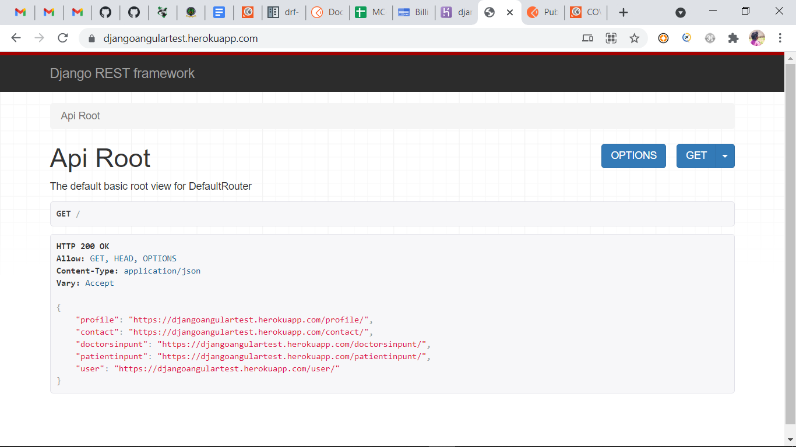

# Covid Tracker

###  Authors
- Joy
- Owino
- Juma
- Angela
- Dennis
- Josephine

### Description
Covid tracking app to help for fast doctor-patient interaction and assistance

### Live link
You can view the live API [here](https://djangoangulartest.herokuapp.com/)
Also view API documentations [here](https://documenter.getpostman.com/view/16617127/TzskEPDp)

### Tested with Django / Python

### Home Image Page

### Technologies used: 
2. Python
3. Django
4. Postgres
6. Heroku
7. Cloudinary
8. Rest framework

## Setup & Installation
### Setup

1. Python3.9
2. Django
4. Pip
5. Postgres
6. virtualenv

### Installation
1. To access this application,
`git clone https://github.com/KMaina/covid-tracking`
1. Create a requirements.txt in the root folder and copy the requirements above.
1. Install the required packages with
`pip install -r requirements.txt`
1. Create a .env file all environment vars
2. create local db and make migrations to it
1. Use below methode to run server:
`python3.9 manage.py runserver`
1. You can make changes to the db with
`python3.9 manage.py makemigrations <app-name> `
`python3.9 manage.py migrate`

### Django Admin
Username: admin
Password: test

### Bugs
None at the moment

### Solution
Solution|Author(s)
--------|---------
Jamari | Owino ([@benson](https://twitter.com/Ben58886580))
Joy | Joy ([@benson](https://twitter.com/Ben58886580))

### Version history
Version|Date|Comments
-------|----|--------
0.0.1|august 09, 2021 | Updated to Django 3.2.5

### Licence
This project is under the [MIT](http://www.MIT.org/licenses/LICENSE-2.0) licence

Copyright (c) 2021 Covid Tracker
